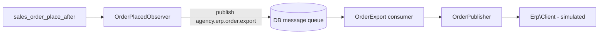

# Magento Agency Demo

A Magento Open Source 2.4.7 reference project by Arshia Mirshekar. It demonstrates how a
production integration layer is structured in Magento — message-queue based order export,
scheduled product import, signed webhooks, REST/GraphQL status endpoints, correlation-ID
logging — using three custom modules, a small demo theme, and a Docker-based local
environment with CI.

**Scope, stated up front:** the external systems are simulated. The ERP/PIM client returns
canned responses so the entire pipeline (observer → queue → consumer → client) can be run,
tested, and inspected without third-party credentials. See
[What is simulated vs. real](#what-is-simulated-vs-real).

## What is included

| Path | Purpose |
| --- | --- |
| `app/code/Agency/Core` | Shared infrastructure: correlation-ID logging, configuration model |
| `app/code/Agency/Integration` | ERP/PIM integration patterns: queues, cron, webhook, REST + GraphQL |
| `app/code/Agency/CheckoutEnhancements` | Custom quote total (conditional handling fee) |
| `app/design/frontend/Agency/hyva-demo` | Custom **Luma-based** demo theme with Tailwind tooling (see note below) |
| `docker-compose.yml`, `dev/nginx`, `dev/php` | Local stack: PHP-FPM 8.2, nginx, MariaDB, Redis, Elasticsearch |
| `scripts/setup.ps1` | One-command Windows setup (install or idempotent re-run) |
| `.github/workflows/ci.yml` | CI: composer validate, PHPCS (PSR-12), PHPStan, PHPUnit |
| `dev/tests/unit` | PHPUnit harness scoped to the Agency modules |

> **Theme naming note:** the theme directory is named `hyva-demo` for historical reasons.
> It is **not** a Hyvä theme — it extends `Magento/luma` and uses a Tailwind config for
> utility-class conventions in its custom templates. No Hyvä code is included.

## Quick start (Windows PowerShell)

Prerequisites: Docker Desktop (running), PowerShell. Ports used: 8080, 3306, 6379, 9200, 9000.

```powershell
git clone https://github.com/Arshiamk/magento-agency.git
cd magento-agency
./scripts/setup.ps1
```

The script starts the containers, runs `composer install` inside the app container (this
restores Magento core directories such as `lib/` and `setup/`, which are intentionally not
committed), installs Magento on first run, deploys static content, and applies the demo
theme and branding. Re-running it is safe: it detects an existing install and only upgrades
when needed.

- Storefront: <http://localhost:8080>
- Admin: <http://localhost:8080/admin> — `admin` / `Password123` (local demo credentials)

Full rebuild from scratch:

```powershell
./scripts/setup.ps1 -Reset
```

## Architecture

### Agency_Core — cross-cutting infrastructure

- **Correlation-ID logging.** `CorrelationIdService` reuses the `X-Correlation-Id` request
  header when an upstream system already assigned one, otherwise generates a UUID (stable
  for the lifetime of the request). A Monolog processor (`CorrelationIdProcessor`) stamps
  that ID onto every record of the dedicated `agency` log channel
  (`Agency\Core\Logger\Logger` → `var/log/agency.log`, wired in `etc/di.xml`), so one
  order export or webhook call can be traced end to end across log lines.
- **Configuration.** A typed config model exposes store-scoped settings (environment label,
  debug logging flag) defined in `etc/adminhtml/system.xml`.

### Agency_Integration — ERP/PIM integration patterns

**Order export (asynchronous, queue-based):**



Checkout stays fast because the observer only publishes a lightweight message
(`OrderExportMessage`, just the order ID) to the `agency.erp.order.export` topic
(`communication.xml`, `queue_topology.xml`, DB connection). The consumer
(`queue_consumer.xml`) loads the order through `OrderRepositoryInterface`, maps it to a
flat ERP payload (line items filtered to purchasable parents, explicit billing-address
mapping), and hands it to the ERP client. Results are wrapped in an
`IntegrationResultInterface` value object. Start the consumer with:

```bash
bin/magento queue:consumers:start agency_erp_order_export
```

**Product import (scheduled):** a cron job (`crontab.xml`, daily at 01:00) pulls the PIM
feed and upserts simple products by SKU via `ProductRepositoryInterface` — existing
products are updated, unknown SKUs are created with sane defaults.

**Inbound webhook:** `POST /agency-integration/webhook` authenticates requests with an
HMAC-SHA256 signature over the raw body (`X-Signature` header, constant-time comparison)
instead of CSRF tokens, then acknowledges the payload.

**Status endpoints:** the same status service is exposed over REST
(`GET /rest/V1/agency/integration/status`, anonymous) and GraphQL
(`{ agencyIntegrationStatus { erp_connection last_sync queue_status } }`), showing the
service-contract pattern: one implementation behind `StatusInterface`, two transports.

All service contracts live under `Api/` with `di.xml` preferences binding them to
implementations, so any piece (most obviously the simulated client) can be swapped without
touching consumers.

### Agency_CheckoutEnhancements — quote total

A custom total collector (`sales.xml`) adds a flat handling fee to carts above a subtotal
threshold, with matching extension attributes on the totals API. The threshold and amount
are constants in this demo; the class documents how a production version would source them
from configuration or checkout input.

## What is simulated vs. real

| Real and fully functional | Simulated / demo-only |
| --- | --- |
| Message queue wiring, publisher, consumer | ERP/PIM HTTP calls (`Erp\Client` returns canned responses) |
| Observer, cron job, DI service contracts | Product feed contents ("Demo Product 1/2") |
| Webhook HMAC validation | Webhook processing (payload is acknowledged, not applied) |
| REST + GraphQL endpoints | Status payload values (e.g. `erp_connection: "simulated"`) |
| Correlation-ID logging pipeline | Default webhook secret (override via admin config) |
| Quote total collection + unit tests | Handling-fee frontend template (illustrative, not wired into checkout layout) |

## Quality tooling

CI (`.github/workflows/ci.yml`) runs on every push and pull request:

1. `composer validate`
2. `composer install` (Magento via the [Mage-OS mirror](https://mirror.mage-os.org/), no auth keys required)
3. `vendor/bin/phpcs --standard=PSR12 app/code/Agency`
4. `vendor/bin/phpstan analyse` (level 5, see `phpstan.neon.dist`)
5. `vendor/bin/phpunit -c dev/tests/unit/phpunit.xml.dist` (Agency unit tests)

Run the same checks locally inside the app container:

```powershell
docker compose exec app vendor/bin/phpcs --standard=PSR12 app/code/Agency
docker compose exec app vendor/bin/phpstan analyse
docker compose exec app vendor/bin/phpunit -c dev/tests/unit/phpunit.xml.dist
```

## Repository layout

Only original work is committed: the Agency modules, theme, Docker/dev configuration, test
harness, and CI. Magento core directories (`lib/`, `setup/`, vendor test suites under
`dev/tests/`) are restored by `composer install` via `magento/magento2-base` and are
gitignored.

## License

MIT — see `LICENSE`.
