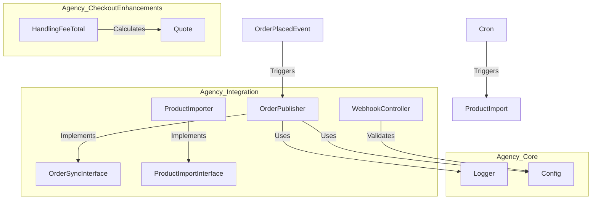

# Architecture Overview

This project follows Domain-Driven Design (DDD) principles adapted for Magento.

## Module Structure

### Agency_Core

- **Layer**: Infrastructure / Shared Kernel
- **Responsibilities**:
  - Centralized Logging (Monolog with Correlation ID)
  - Configuration Management (Typed Config)
  - Shared Value Objects

### Agency_Integration

- **Layer**: Application / Interface
- **Responsibilities**:
  - **Wrappers (Adapters)**: `OrderPublisher` wraps the ERP Client.
  - **Service Contracts**: `OrderSyncInterface`, `ProductImportInterface`.
  - **Async Processing**: Uses Magento Message Queue for scalability.

### Agency_CheckoutEnhancements

- **Layer**: Presentation / Domain
- **Responsibilities**:
  - Custom Totals calculation.
  - Frontend components (Alpine.js) for handling fees.

## Diagram

